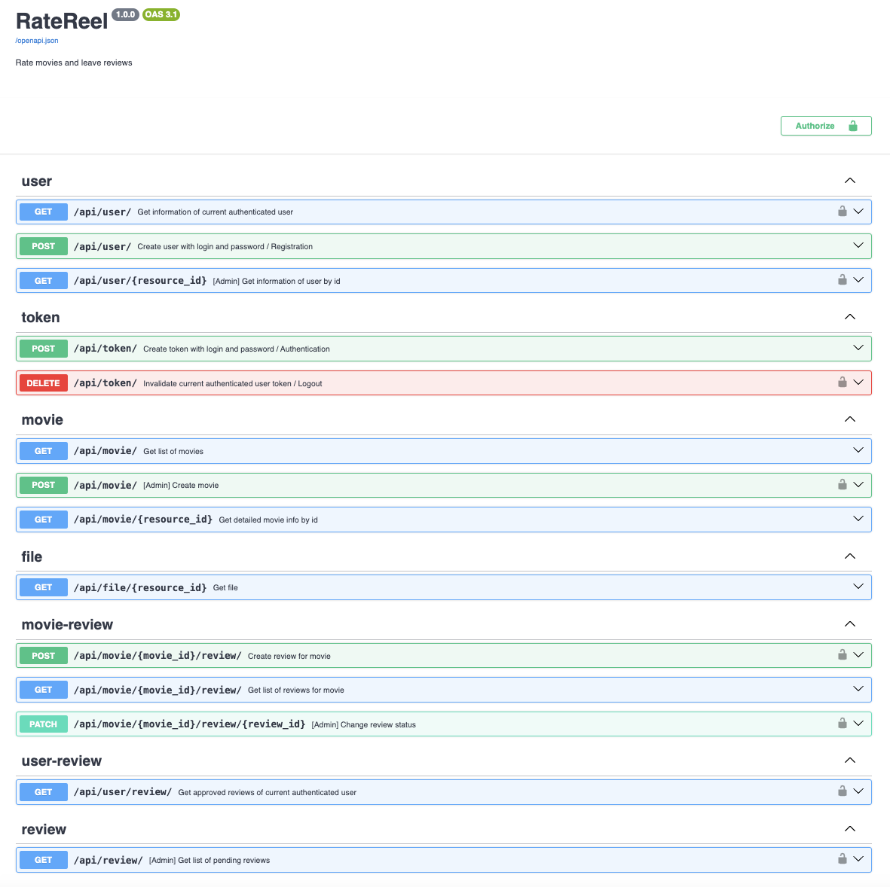
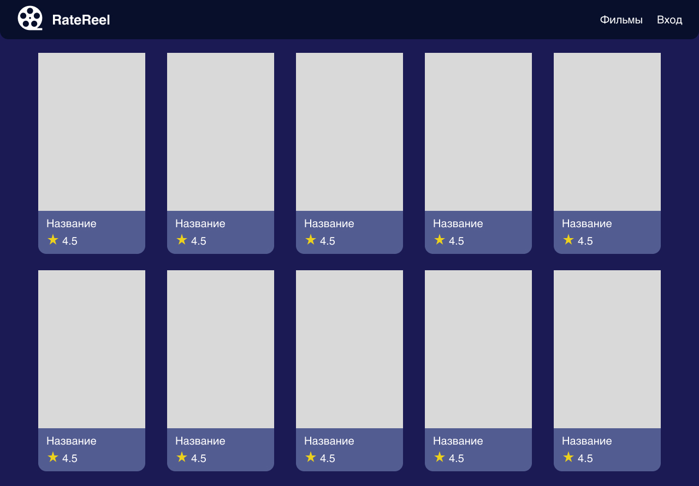
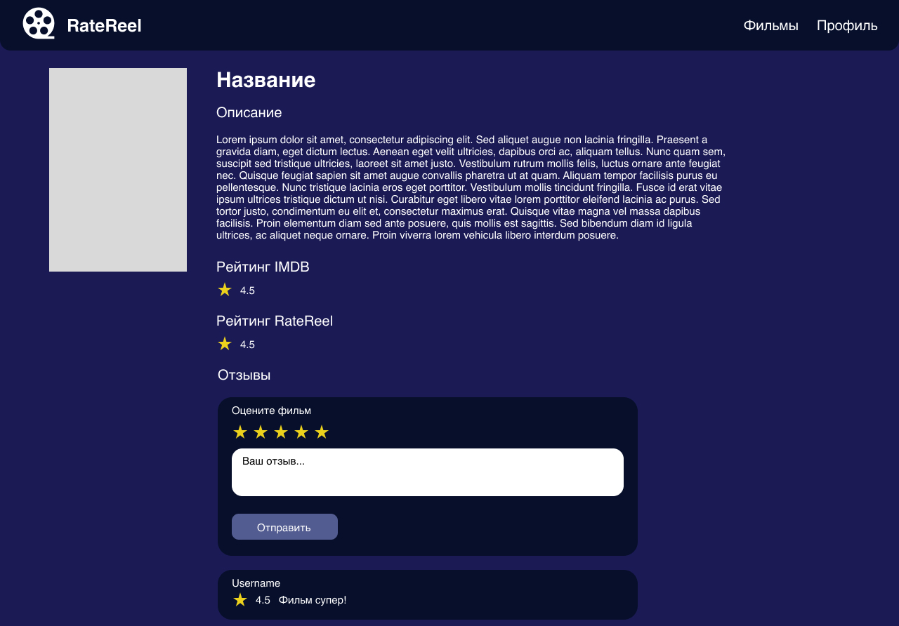
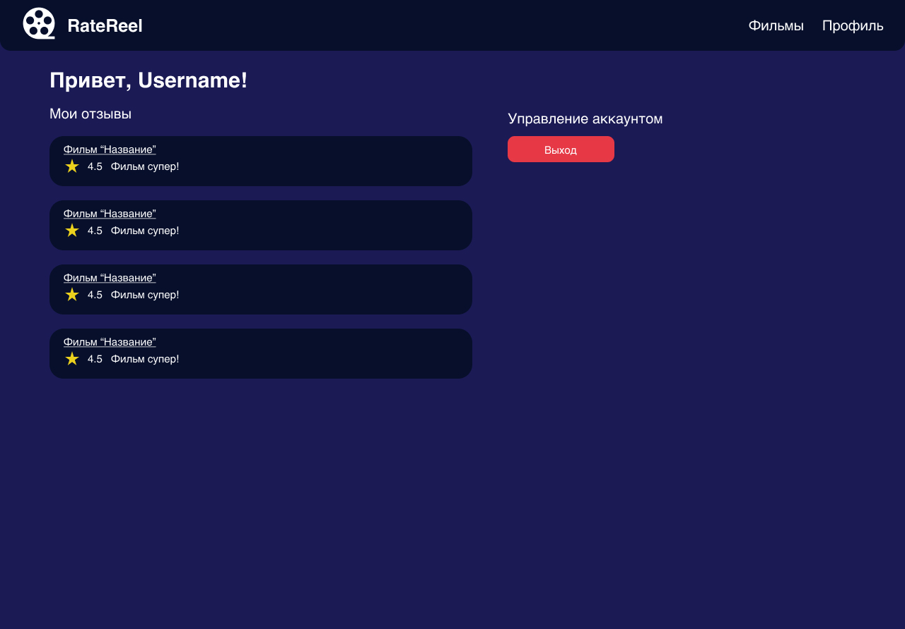

## RateReel — сервис отзыва о фильмах

### Стек технологий
Backend:
- Python FastAPI
- PostgreSQL

Frontend:
- HTML
- CSS
- JS

### Эндпоинты Backend


### Макеты
[Figma](https://www.figma.com/design/otMersv9uDJnXNWd3Rv2Pf/RateReel?node-id=0-1&t=IV7sC4ZB5q496SyN-1)

#### Авторизация и регистрация


#### Главная страница с фильмами


#### Детальная страница о фильме


#### Профиль


#### [Админ] Добавление фильма


#### [Админ] Модерация отзывов


### Запуск приложения

#### Запуск Backend
1. Установка зависимостей
```bash
poetry install
```
2. Запуск базы данных
```bash
docker compose up --build -d
```
3. Накатка актуальной миграции БД
```bash
alembic upgrade head
```
4. Заполнение сущностей о Фильмах с IMDB
```bash
poetry run python populate_movies.py
```
5. Заполнение отзывов
```bash
poetry run python populate_reviews.py
```
6. Запуск API
```bash
poetry run python -m api
```

#### Запуск Frontend
1. Установка зависимостей
```bash
npm install
```
1. Запуск live server
```bash
npm run live
```

### Авторство
Георгий Рыбкин, 2024